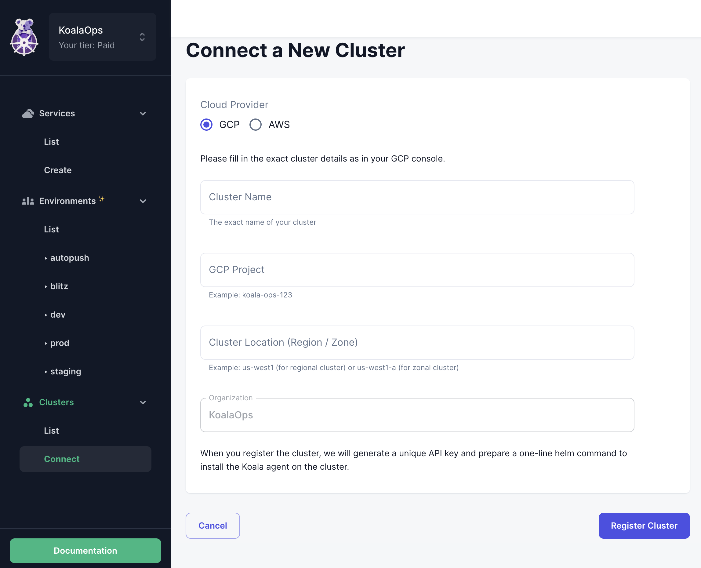
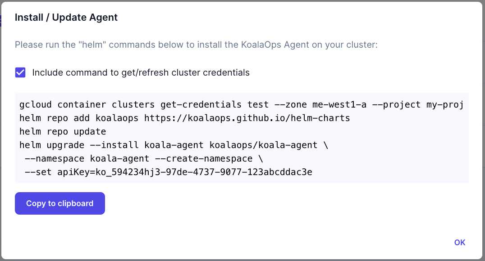
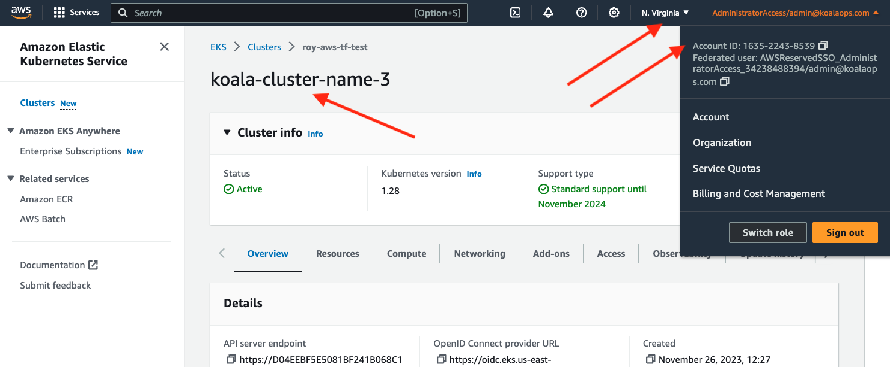
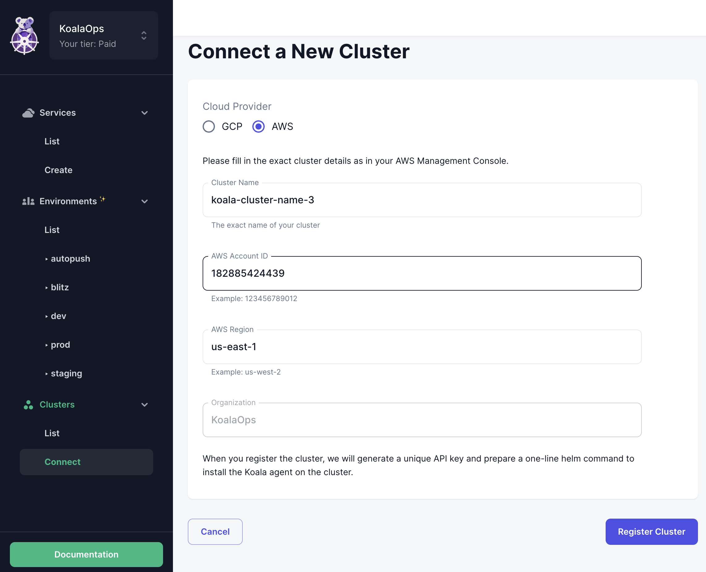
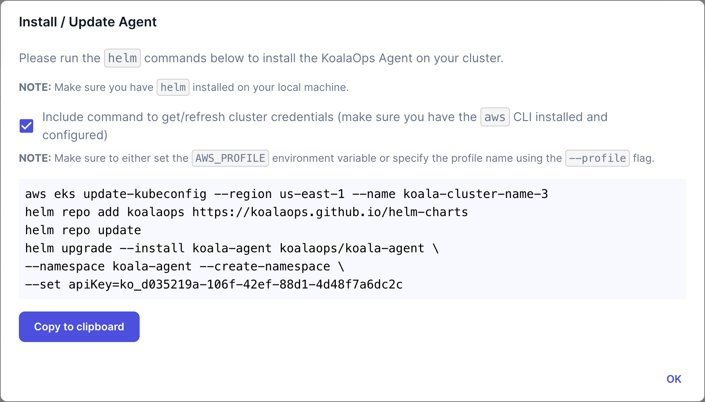

# Clusters

KoalaOps currently supports GKE (Google Cloud) and EKS (AWS). We assume that your clusters (or at least one cluster) are already configured and operational. If you need help provisioning a new cluster, please [contact us](mailto:support@koalaops.com) and we'll be happy to assist.
To use KoalaOps, you are required to connect every k8s cluster you intend to use.

KoalaOps pulls information from the cluster using our [agent](agent.md), configures your code (k8s manifests, CI/CD etc), and performs operations (via CLI or agent) according to the clusters configured for the organization and for each service.

## Cluster requirements
   
Koala currently requires two extremely common tools to be installed in the cluster. Please make sure your cluster has them installed (or [let us know](mailto:support@koalaops.com) if you need us to support alternatives). You can use Helm or direct kubectl installation.

- Nginx ingress controller ([instructions](https://kubernetes.github.io/ingress-nginx/deploy/))
- cert-manager ([instructions](https://cert-manager.io/docs/installation/))
  - cert-manager needs an "Issuer" to generate new certificates. You can install a basic configuration using Let's Encrypt by applying the following to your cluster (replace the email address with your own):

    ```yaml
    kubectl apply -f - <<EOF
    apiVersion: cert-manager.io/v1
    kind: ClusterIssuer
    metadata:
        name: letsencrypt
        namespace: cert-manager
    spec:
        acme:
            # You must replace this email address with your own.
            # Let's Encrypt will use this to contact you about expiring
            # certificates, and issues related to your account.
            email: user@example.com  # (1)
            server: https://acme-v02.api.letsencrypt.org/directory
            privateKeySecretRef:
            # Secret resource that will be used to store the account's private key.
                name: letsencrypt
            # Add a single challenge solver, HTTP01 using nginx
            solvers:
            - http01:
                ingress:
                    class: nginx
    EOF
    ```

    1.  :warning: Update to your own email address.

??? info "Make sure you're authenticated to your cloud provider's cluster"

    The Koala Agent installation requires your to be authenticated to your cluster.
    See more details on how to do so in the Koala Agent [Requirements section](./agent.md#requirements).

## Connect a Cluster

=== "GCP"

    You will need the following information about the cluster:

    - Cluster name (The exact name of your cluster as in GCP console)
    - GCP project ID (for example: koala-ops-123)
    - Zone (for example me-west1-a)

    Here is an example of how to extract those values from the GCP console:

        

    You can register the cluster using either the Google Web App or the Koala CLI. Find the instructions for both options below.

    <Tabs>
      <Tab title="Web App">
        ### Step 1: Register Cluster

        Open the web app and on the left side menu click Clusters -> Connect. Fill in:

        - Cloud Provider: GCP
        - Cluster name
        - GCP project ID
        - Zone

        Click the 'Register' button. 

         

        ### Step 2: Install Agent

        Install the agent using `helm`: copy the command that was generated after clicking on Register into your terminal:

        

        You can always fetch this command in the future from the clusters list section.
      </Tab>
      <Tab title="CLI">
        `koala cluster register cluster-name -p <project ID> -z <zone>`

        Then:

        - Install the [agent](agent.md). After running the previous command you will receive a `helm install` command pre-populated with the unique API key for the cluster, which will install the agent. If needed, you can customize the namespace in which the agent will run.
        - Make sure that the cluster is connected by looking at the cluster list in the web app. Before the agent is first installed it will say "Waiting for first check in"; when connected it will say "online".     
      </Tab>
    </Tabs>

=== "AWS"

    You will need the following information about the cluster:

    - Cluster name (The exact name of your cluster as in the AWS console)
    - AWS Account ID
    - AWS Region (for example us-west-2)

    Here is an example of how to extract those values from the AWS console:

    

    ### Step 1: Register Cluster

    Open the web app and on the left side menu click Clusters -> Connect. Fill in:

    - Cloud Provider: AWS
    - Cluster name
    - AWS Account ID
    - AWS Region

    The organization field reflects your current Koala organization which can only be changed by using the dropdown on the top left part of the Koala console next to the Koala logoaws. 

    Click the 'Register Cluster' button. 

     

    ### Step 2: Install Agent

    Install the agent using `helm`: copy the command that was generated after clicking on Register into your terminal:

    

    You can always fetch this command in the future from the clusters list section.

## Configure DNS via k8s Ingress

??? info
    Kubernetes Ingress is an API object that provides routing rules to manage access to services within a Kubernetes cluster. It acts as a single entry point for external traffic to your Kubernetes services, making it easier to manage and expose your applications to the world.

To enable ingress for your services in the cluster, you should configure the DNS for your domain to point to the cluster. This should be done in your DNS provider.

If a service is deployed in a single cluster, you can directly point the DNS to the cluster's external IP address. You can see it in your cloud provider's console, or in the cluster list in [app.koalaops.com](http://app.koalaops.com).

If you're using a load balancer across clusters, we will soon add support for that, but for now you'll need to continue to manage that manually. Please continue with the configuration as you would without KoalaOps.

