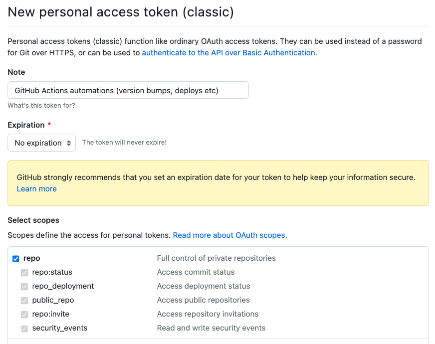

# GitHub Actions

GitHub Actions is a continuous integration and continuous delivery (CI/CD) platform that allows you to automate your software development workflows right in your GitHub repository. It provides a simple and powerful way to build, test, and deploy your code, as well as automate other tasks such as managing issues and pull requests.

## Configuring GitHub Actions

GitHub Actions uses secrets to store sensitive information, such as API keys and passwords. Secrets are encrypted and stored in GitHub's secure environment.

=== "GCP"

    KoalaOps configures GitHub Actions workflows for you that expect a secret called `GCP_CREDENTIALS` to be present.
    This secret needs to represent a key file for a service account with permissions to interact with k8s clusters and GCP Artifact Registry.

    To make it as easy as possible, the `koala` CLI can be used to automate the creation of a service account (if one doesn't exist), add the necessary roles, and download the key file.
    Once you've installed the CLI ([instructions](/docs/getting-started/#install-koala-cli)):

    Make sure you're working with the right project in GCP:

    ```
    gcloud config get-value project
    ```

    If not, set it:

    ```
    gcloud config set project <project>
    ```

    Then create or update a service account, set roles, generate key and download file using:
    ```
    koala auth sa-creds -n <name> -p <project>
    ```

    This will save a file called `sa-key.json` to your current working dir.


=== "AWS"
    KoalaOps configures GitHub Actions workflows for you that expect a secret called `AWS_CREDENTIALS` to be present.
    This secret needs to represent a key file for a service account with permissions to interact with k8s clusters and AWS Artifact Registry.

    ??? "Coming Soon"
        This section will be automated using the Koala CLI in the near future. 

    #### Set your AWS region and IAM user name
    ```bash
    AWS_REGION="us-east-1"
    IAM_USER_NAME="github-actions"
    ```

    #### Create an IAM user
    ```bash
    echo "Creating IAM user..."
    aws iam create-user --user-name $IAM_USER_NAME
    ```

    #### Attach policies for ECR and EKS
    ```bash
    echo "Attaching policies to IAM user..."
    aws iam attach-user-policy --user-name $IAM_USER_NAME --policy-arn arn:aws:iam::aws:policy/AmazonEC2ContainerRegistryFullAccess
    aws iam put-user-policy --user-name $IAM_USER_NAME --policy-name EKSKoalaAccessV1 --policy-document '{
        "Version": "2012-10-17",
        "Statement": [
            {
                "Action": [
                    "eks:AccessKubernetesApi",
                    "eks:Describe*",
                    "eks:List*"
                ],
                "Effect": "Allow",
                "Resource": "*"
            }
        ]
    }'
    ```

    #### Create an access key for the user
    ```bash
    echo "Creating access key..."
    credentials=$(aws iam create-access-key --user-name $IAM_USER_NAME)
    ```

    #### Extract access key and secret key

    === "Without jq:"
        ```json
        {
            "AccessKey": {
                "UserName": "github-actions",
                "AccessKeyId": "THE-KEY",
                "Status": "Active",
                "SecretAccessKey": "SECRET",
                "CreateDate": "2023-11-26T21:32:50+00:00"
            }
        }
        ```
    
    === "With jq"
      ```bash
      echo "Put the following secrets in github organization"
      access_key=$(echo $credentials | jq -r '.AccessKey.AccessKeyId')
      secret_key=$(echo $credentials | jq -r '.AccessKey.SecretAccessKey')
      ```

    #### Define Github Secrets 
    Place the link below in your browser (Replace [OrganizationName] with your organization):

    https://github.com/organizations/[OrganizationName]/settings/secrets/actions/new

    On this page, add each of the following names/values as a separate key in Github:
    ```bash
    AWS_ACCESS_KEY_ID=AccessKeyId
    AWS_SECRET_ACCESS_KEY=SecretAccessKey
    ```


### Saving the Secret in GitHub

- Go to the Settings page for your organization.
- Click on the 'Secrets and variables' tab on the left hand side.
- Click on the New organization secret button.
- Enter a name for your secret: `GCP_CREDENTIALS` or `AWS_CREDENTIALS` according to the cloud provider.
- Enter the value of your secret: copy the entire contents of the `sa-key.json` file created in the previous step.
- Click on the 'Add secret' button.


## Working with Protected Branches

KoalaOps creates GitHub Actions workflows for you, which in some cases need to automatically push changes to your git repo:

* Automatic handling of semantic versioning: bumping your service's version (in a VERSION file in the root dir) in each release.
* If using GitOps mode, deploying versions via updating kustomize overlays.

If you use GitHub's protected branches feature and restrict pushes to `main`, the GitHub Actions Workflows won't be able to push these changes, because the built-in [GITHUB_TOKEN token](https://docs.github.com/en/actions/security-guides/automatic-token-authentication) does not have sufficient permissions. This is a well-known limitation of GitHub, requiring slightly inelegant workarounds (see example [discussion / FR](https://github.com/orgs/community/discussions/13836)).

The simplest solution is to create a [PAT](https://docs.github.com/en/authentication/keeping-your-account-and-data-secure/managing-your-personal-access-tokens) (Personal Access Token), with a user that has bypass branch protection permissions. Organization and repository administrators can always bypass required pull requests, but you can also create a "service account" specifically for this if you prefer and allow it to bypass branch protection via `Repository settings -> Branches -> main -> Edit -> Allow specified actors to bypass required pull requests`. 

Step-by-step:

1. **Create a PAT** via [https://github.com/settings/tokens](https://github.com/settings/tokens). Make sure to grant it full repo access, but you don't need other permissions. It is recommended to only use this token for GitHub Actions, and since it's easy to regenerate by repeating this process, you can avoid storing it anywhere else once you complete this process. Copy the new token:
   
2. **Create a new organization secret** via Settings -> Secrets and Variables -> Actions. Choose a name, e.g. `GHA_PAT` and paste the PAT you created in the previous step as the value.
3. **Update the Workflows** `release.yml` and (optionally, for GitOps mode) `deploy.yml` to use the PAT when checking out the code:

    ```yaml
    - uses: actions/checkout@v3
      with:
        token: ${{ secrets.GHA_PAT }}
    ```

The workflows will now use the new PAT instead of the default GITHUB_TOKEN, and will be able to push changes even if branch protection is enabled.